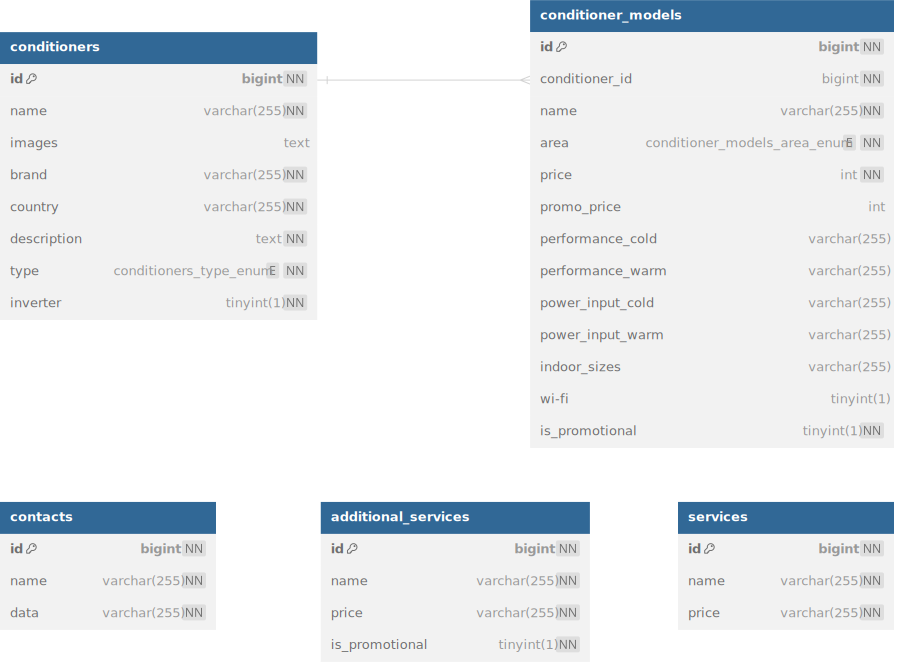

# Climat i Tochka

## Описание проекта

Веб-каталог кондиционеров с панелью администратора на Filament и дополнительными информационными страницами.

## Установка и настройка

### Требования

-   PHP 8.1
-   Composer
-   Node.js & npm
-   MySQL

### Установка

> Если вы хотите использовать **Docker Compose**:
>
> 1.  Клонируйте репозиторий:
>
> ```bash
> git clone https://github.com/gyrovbogdan/climat-i-tochka.git
> ```
>
> 2.  Перейдите в директорию проекта:
>
> ```bash
> cd climat-i-tochka
> ```
>
> 3. Запустите контейнеры:
>
> ```bash
>    docker-compose up -d
> ```
>
> 4. Скопируйте файл `.env.example` в `.env`:
>
> ```bash
>   cp .env.example .env
> ```
>
> 5. Установите зависимости, и настройте Laravel с помощью скрипта run.sh:
>
> ```bash
>   docker exec my_dict_app bash ./climat-i-tochka/docker/run.sh
> ```
>
> Сайт будет доступен по адресу `http://localhost:8080`

Для обычной установки следуйте следующей инструкции:

1. Клонируйте репозиторий:

    ```bash
    git clone https://github.com/gyrovbogdan/climat-i-tochka.git
    ```

2. Перейдите в директорию проекта:

    ```bash
    cd climat-i-tochka
    ```

3. Установите зависимости PHP с помощью Composer:

    ```bash
    composer install
    ```

4. Установите зависимости JavaScript с помощью npm:

    ```bash
    npm install
    ```

5. Скопируйте файл `.env.example` в `.env` и настройте его:

    ```bash
    cp .env.example .env
    ```

6. Сгенерируйте ключ приложения:

    ```bash
    php artisan key:generate
    ```

7. Настройте базу данных и выполните миграции:

    ```bash
    php artisan migrate
    ```

8. Сделайте файлы в storage доступными в web:

    ```bash
    php artisan storage:link
    ```

9. Запустите сервер разработки:
    ```bash
    php artisan serve
    ```

## Использование

После установки и запуска приложения перейдите по адресу `http://localhost:8000` в вашем браузере. Вы сможете увидеть главную страницу приложения. В навигационной панеле вы увидите доступные страницы.

## Архитектура и структура проекта

### База данных



#### Основные сущности

-   **Conditioner** — Кондиционер, который имеет ряд своих атрибутов и набор моделей.
-   **Conditioner Model** — Модель кондиционера.

Разделение на две модели было создано потому что серия кондиционера имеет страну производителя, тип и бренд общий для всех моделей в этой серии. При этом каждая модель имеет ряд атрибутов, которые отличаются от мощности.

### Controllers

-   **ConditionerController** — Контроллер для отображения кондиционеров.
-   **HomeController** — Контроллер для отображения главной страницы.
-   **ServicesController** — Контроллер для отображения страницы услуг.
-   **VentilationController** — Контроллер для отображения условий заказа вентиляции.

## Технологии

-   Laravel
-   MySQL
-   Bootstrap
-   Filament

## Контакты

Если у вас есть вопросы или предложения, пожалуйста, свяжитесь со мной по адресу [gyrovbogdan@gmail.com](mailto:gyrovbogdan@gmail.com).
